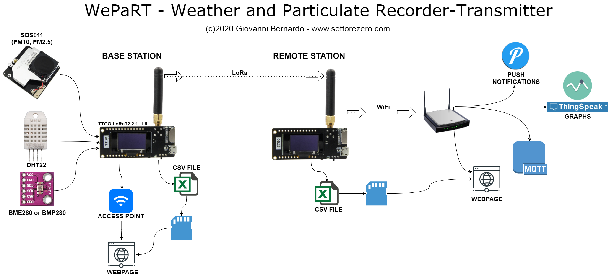

  

# WePaRT

This project is based on the LiLyGO TTGO LoRa32 version 2.1_1.6 and is composed of two parts:  
- A Base Station
- A Remote Station

### Base Station
Think of this as a station that is placed where WiFi and/or Telephone is not accessible.  
Is the one where sensors are attached. Actually those sensors are used:  
- DHT22 (humidity, temperature)
- BME280 (pressure, temperature, humidity) Or BMP280 (pressure, temperature)
- SDS011 (particulate matter: PM10 and PM2.5)  

Base station gets data from sensors and:
- Save them on a microSD card in CSV format
- propagate them through LoRa to the Remote Station
- act as an access point for showing real-time data on a webpage

### Remote Station
Is the one attached to a WiFi infrastructure. Receives data from the Base Station and:
- transmits them to Thingspeak for graph generation
- transmits them over MQTT
- saves the good received data in a CSV, adding the current time/date taken from an NTP server
- saves the bad received data in a text file for further analisys of bad received packets
- shows a webpage by navigating to his IP address in the same wifi network were device is connected

### Documents
- In the [STL Folder](/stl) are contained the STL parts to be 3D-printed.
- In the [docs Folder](/docs) are contained Datasheets and schematics.
- In the [Arduino Folder](/arduino) are contained the programs to be uploaded on the Stations

### Known Problems
- showing always some data, OLED's pixel burns out so will remain a "shadow". Solution (not yet implemented): a function like a screensaver
- if the connected SD broke up, the station wouldn't start-up since the connected SD can be detected but will fail other functions giving an unexpected behaviour that can lead to a continuos reset. Since the remote station can be placed in a place where is not visibile, if this happens, we will never see a failure: we will see the base station showing always the same data. Solution (not yet implemented): detect a timeout on the base station

### Links
- You can read a full description of the WePaRT on the [settorezero blog](https://www.settorezero.com/wordpress/wepart-stazione-monitoraggio-meteo-polveri-sottili-particolato)
- You can see actual data sent to Thingspeak by our WePaRT [here](https://thingspeak.com/channels/1107465)
- [This](http://www.bahar.asia/Product/26/name?BWP-10008-A2) is the enclosure I've used for the Remote Station
